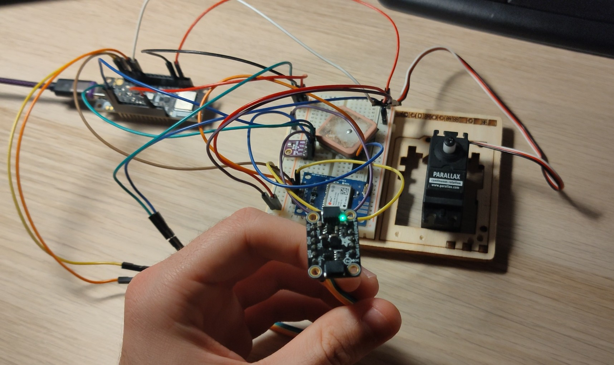

# Guión Práctica 3: Sensores y actuadores con IMU (LSM6DS33) en ESP32-C3

## Adaptación de la Práctica 3 a la plataforma ESP32-C3

En esta práctica se trabaja la integración de sensores y actuadores en un sistema embebido, cuyo objetivo principal es cerrar el lazo de control: adquisición de datos del entorno, procesamiento de la información y actuación sobre el mundo físico.

La práctica original estaba diseñada para realizarse sobre una Raspberry Pi, utilizando una unidad de medición inercial (IMU) **LSM6DS33** conectada por bus **I2C** para obtener la orientación. A partir de estos datos, se actuaba sobre un servomotor mediante señales PWM.

Para la realización de esta práctica en la plataforma **ESP32-C3**, se mantiene el mismo sensor (LSM6DS33) y actuador, pero se migra la arquitectura software desde un sistema operativo completo (Linux/Raspbian) a un entorno de tiempo real sobre metal (**ESP-IDF**). Además, se implementa una lógica de control basada en umbrales de inclinación (*Pitch*) para controlar la dirección de giro de un servomotor de rotación continua.



## Cambios en la plataforma hardware

La ESP32-C3 dispone de un controlador hardware para el bus **I2C (Inter-Integrated Circuit)**, lo que permite la comunicación síncrona maestro-esclavo con el sensor. A diferencia de la implementación original en Raspberry Pi (que solía usar *bit-banging* o drivers del kernel), aquí tendremos control directo sobre la configuración del bus.

Por otro lado, la actuación sobre el servomotor se realiza mediante el periférico **LEDC (LED Control)**. Este periférico es capaz de generar señales PWM con alta precisión y sin carga para la CPU, lo cual es crítico para mantener la estabilidad del servo mientras la CPU se ocupa de los cálculos matemáticos del filtro de orientación.

La práctica se centra en:

* El uso del periférico **I2C** para la lectura de registros del sensor LSM6DS33.
* El procesamiento matemático de los datos crudos (fusión de sensores con filtro complementario).
* El uso del periférico **LEDC** para generar pulsos de control de velocidad (1300µs, 1500µs, 1700µs).

## Cambios en el entorno software

Mientras que la práctica original se apoyaba en librerías de alto nivel como *WiringPi*, en esta adaptación se emplea **ESP-IDF**.

Para la lectura del sensor, se utiliza el driver `i2c_master`, configurando la ESP32-C3 como maestro del bus a 400 kHz. El software debe gestionar explícitamente la escritura de registros de configuración en el sensor (para "despertarlo" y ajustar escalas) y la lectura secuencial de los datos de aceleración y velocidad angular.

Para la estimación de la orientación, se sustituye la lectura directa por un algoritmo de **Fusión de Sensores**. Dado que el acelerómetro es ruidoso ante vibraciones y el giróscopo tiene deriva (*drift*) con el tiempo, se implementa un **Filtro Complementario** que combina lo mejor de ambos para calcular el ángulo de cabeceo (*Pitch*).

Finalmente, la lógica de control ya no posiciona el servo en un ángulo fijo, sino que decide su **velocidad y sentido de giro** basándose en si la inclinación supera unos umbrales predefinidos ().

## Configuración de los periféricos en la ESP32-C3

La ESP32-C3 gestiona sus periféricos mediante registros mapeados en memoria. A continuación, se describen los bloques hardware que intervienen en el proceso y sus registros asociados.

---

### Registros principales del periférico I2C

#### I2C_SDA_HOLD_REG / I2C_SDA_SAMPLE_REG

Estos registros controlan la temporización de la señal de datos (SDA) respecto al reloj (SCL). Son críticos para cumplir con las especificaciones del protocolo I2C, especialmente a velocidades de 400 kHz (Fast Mode). Una configuración incorrecta aquí puede provocar errores de *NACK* o datos corruptos.

#### I2C_MASTER_TR_REG

Es el registro que contiene la memoria FIFO para la transmisión y recepción. Los comandos de escritura, direcciones de esclavos y datos a enviar se cargan aquí. El driver de ESP-IDF abstrae su uso, gestionando las interrupciones para vaciar o llenar este buffer automáticamente.

#### I2C_FIFO_CONF_REG

Permite configurar los umbrales de la memoria FIFO. Es fundamental para determinar cuándo el procesador debe intervenir para leer los datos recibidos del sensor antes de que el buffer se desborde.

---

### Registros internos del sensor LSM6DS33

Además de los registros de la ESP32, es necesario manipular los registros internos del propio sensor a través del bus I2C:

* **CTRL1_XL (0x10):** Activa el acelerómetro, define la frecuencia de muestreo (ODR) a 104 Hz y la escala a .
* **CTRL2_G (0x11):** Activa el giróscopo, define la frecuencia a 104 Hz y la escala a 245 dps (*degrees per second*).
* **CTRL3_C (0x12):** Configura el comportamiento del bloque de datos (BDU) y el auto-incremento de direcciones, vital para leer los 14 bytes de datos en una sola transacción.

---

### Registros principales del periférico LEDC (PWM)

#### LEDC_LSTIMERn_CONF_REG

Configura el temporizador base para la generación PWM. Para el control de servos, se ajusta el divisor de reloj para obtener una frecuencia de **50 Hz** (periodo de 20 ms). También define la resolución en bits (14 bits en esta práctica), lo que determina la granularidad del control de velocidad.

#### LEDC_LSCHn_DUTY_REG

Define el ciclo de trabajo. En servos de rotación continua:

* **1500 µs (aprox. 7.5% duty):** Detiene el motor.
* **>1500 µs:** Giro en un sentido (CW/CCW).
* **<1500 µs:** Giro en sentido contrario.

---

## Justificación del uso de drivers y algoritmos

### Inicialización y Configuración (I2C)

Aunque es posible realizar *bit-banging* sobre pines GPIO, el uso del driver `i2c_driver_install` permite utilizar el hardware dedicado, liberando a la CPU de la generación de la señal de reloj.

El código implementado realiza una detección automática de la dirección del sensor (0x6A o 0x6B) leyendo el registro `WHO_AM_I`, garantizando robustez ante diferentes versiones de placas breakout:

```c
static uint8_t detect_lsm6_addr(void) {
    // Intenta leer WHO_AM_I en ambas direcciones posibles
    if (read_reg(0x6B) == 0x69) return 0x6B;
    if (read_reg(0x6A) == 0x69) return 0x6A;
    return 0; // Error
}

```

### Algoritmo de Fusión (Filtro Complementario) Para obtener un ángulo de inclinación (*Pitch*) fiable, no basta con leer el acelerómetro, ya que este es muy sensible a movimientos bruscos (aceleraciones lineales).

Se implementa la siguiente fórmula matemática en el bucle principal:

Donde:

* : Ángulo calculado con `atan2` de las componentes de gravedad.
* : Integración de la velocidad angular.
*  (0.98): Factor de confianza en el giróscopo para filtrar ruido de alta frecuencia.

---

## Análisis de los resultados

El sistema final integra la lectura, el procesamiento y la actuación en un ciclo continuo. El comportamiento esperado del sistema desarrollado es el siguiente:

### 1. Zona Muerta (Estado de Reposo)

Cuando la placa se encuentra en una posición horizontal o con una inclinación suave (entre -40º y +40º):

* El cálculo del *Pitch* arroja valores bajos.
* El software envía un pulso de **1500 µs** al servo.
* **Resultado físico:** El servomotor permanece **detenido**.

### 2. Inclinación Positiva (Cabeceo hacia adelante)

Al inclinar la placa superando los +40º:

* El código detecta la condición `pitch > 40`.
* Se actualiza el PWM a **1300 µs**.
* **Resultado físico:** El servo gira a velocidad constante en sentido **Horario (CW)** (o anti-horario según el modelo).

### 3. Inclinación Negativa (Cabeceo hacia atrás)

Al inclinar la placa por debajo de -40º:

* El código detecta la condición `pitch < -40`.
* Se actualiza el PWM a **1700 µs**.
* **Resultado físico:** El servo gira a velocidad constante en sentido **Anti-horario (CCW)**.

### Tabla Resumen de Actuación

| Ángulo Pitch (Inclinación) | Acción Lógica | Pulso PWM (µs) | Comportamiento Servo |
| --- | --- | --- | --- |
|  | Giro Derecha | 1300 µs | Rotación Continua Sentido A |
|  a  | Stop | 1500 µs | Motor Detenido |
|  | Giro Izquierda | 1700 µs | Rotación Continua Sentido B |

Este comportamiento demuestra la capacidad de la ESP32-C3 para realizar procesamiento matemático en coma flotante (cálculo de `atan2` y filtros) en tiempo real, manteniendo simultáneamente la generación de señales de control estables para actuadores mecánicos.